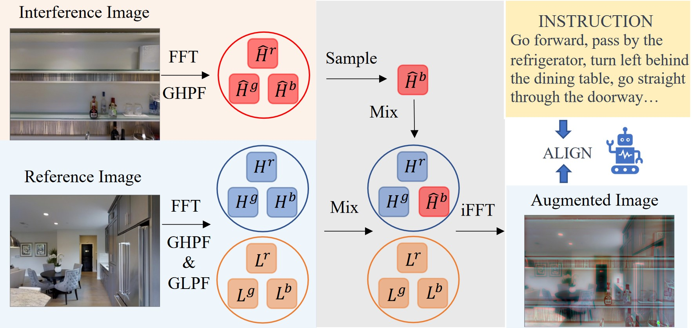

<h2>Frequency-enhanced Data Augmentation for Vision-and-Language Navigation</h2>

    <a href='https://scholar.google.com/citations?user=RHPI-NQAAAAJ&hl=zh-CN' target='_blank'>Keji He</a>;
    <a href='https://scholar.google.com/citations?hl=en&user=XdahAuoAAAAJ&view_op=list_works' target='_blank'>Chenyang Si</a>;
    <a href='https://zhihelu.github.io/'>Zhihe Lu</a>;
    <a href='https://yanrockhuang.github.io/' target='_blank'>Yan Huang</a>;
    <a href='http://scholar.google.com/citations?user=8kzzUboAAAAJ&hl=zh-CN' target='_blank'>Liang Wang</a>;
    <a href='https://sites.google.com/site/sitexinchaowang/?pli=1' target='_blank'>Xinchao Wang</a>

<h4 align="center">
  <a href="https://openreview.net/pdf?id=eKFrXWb0sT" target='_blank'>Paper</a>,
  <a href="https://openreview.net/attachment?id=eKFrXWb0sT&name=supplementary_material" target='_blank'>Supplementary Material</a>
</h4>

<h3><strong>Accepted to <a href='https://neurips.cc/' target='_blank'>NeurIPS 2023</a></strong></h3>

## Abstract

Vision-and-Language Navigation (VLN) is a challenging task that requires an agent to navigate through complex environments based on natural language instructions. In contrast to conventional approaches, which primarily focus on the spatial domain exploration, we propose a paradigm shift toward the Fourier domain. This alternative perspective aims to enhance visual-textual matching, ultimately improving the agent’s ability to understand and execute navigation tasks based on the given instructions. In this study, we first explore the significance of high-frequency information in VLN and provide evidence that it is instrumental in bolstering visual-textual matching processes. Building upon this insight, we further propose a sophisticated and versatile Frequency-enhanced Data Augmentation (FDA) technique to improve the VLN model’s capability of capturing critical high-frequency information. Specifically, this approach requires the agent to navigate in environments where only a subset of high-frequency visual information corresponds with the provided textual instructions, ultimately fostering the agent’s ability to selectively discern and capture pertinent high-frequency features according to the given instructions. Promising results on R2R, RxR, CVDN and REVERIE demonstrate that our FDA can be readily integrated with existing VLN approaches, improving performance without adding extra parameters, and keeping models simple and efficient.

## Method

## TODOs
* [ ] Release Feature Extract Code.
* [ ] Release Extracted Feature (by HAMT-ViT).
* [ ] Release VLN Code (TD-STP on R2R).

